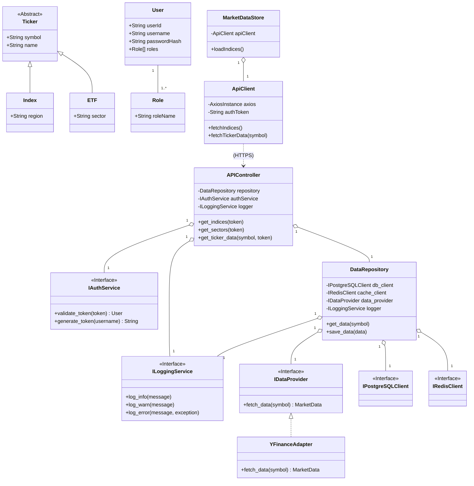
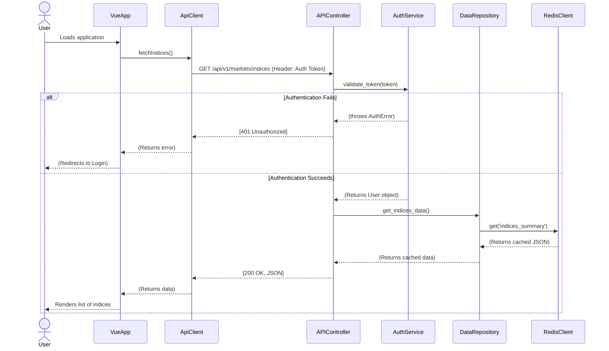
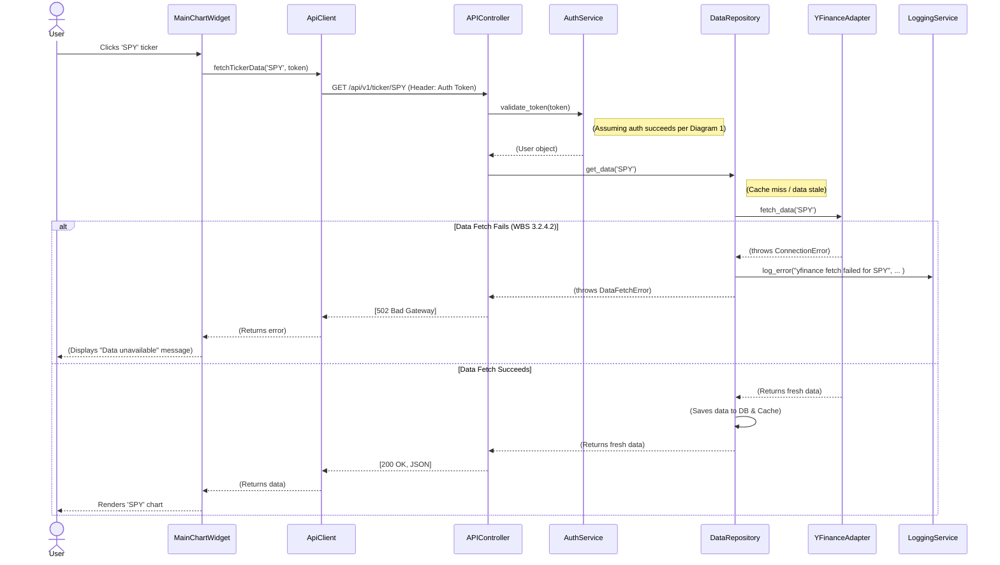
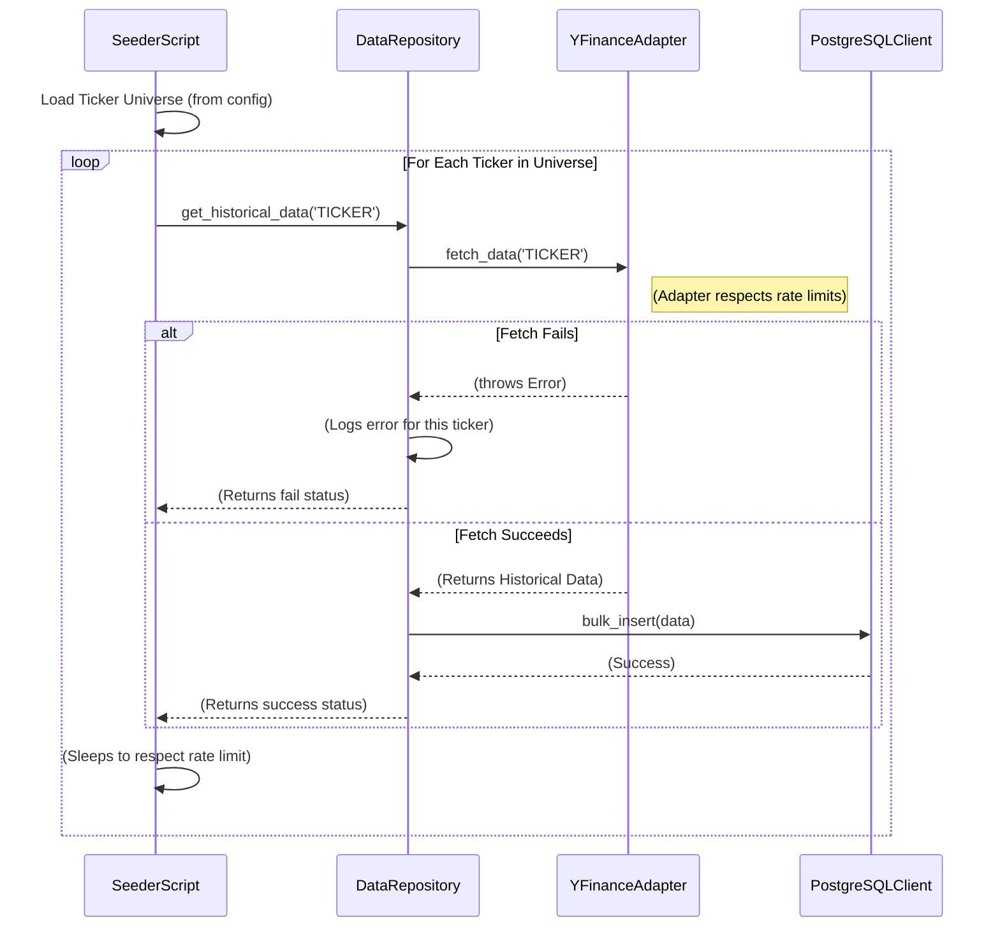
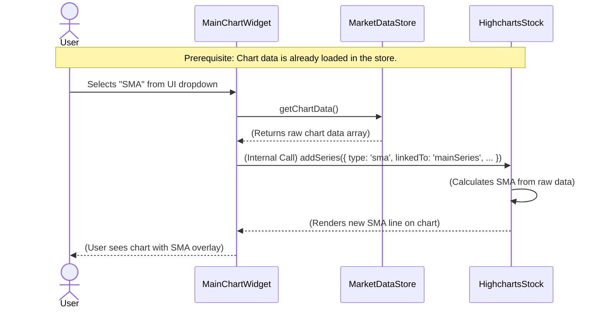

Thank you for the detailed analysis. This feedback is critical for hardening the design against real-world failures and operational realities. The initial design was indeed "happy path" focused, and these revisions incorporate the necessary robustness, security, and operational flows identified in your critique.

Here are the updated UML artifacts, revised to address all critical flaws and warnings.

-----

## Class Diagram (Revised)

This diagram is updated to include **Security** (User, Role, AuthService) and **Monitoring** (ILoggingService) entities. The `APIController` and `DataRepository` now depend on these abstractions, integrating security and logging into the core design.



-----

## Activity Diagram (Revised)

This workflow for requesting market data is now updated to show the **critical error handling path** (WBS 3.2.4.2). It explicitly models what happens when the external `YFinanceAdapter` fails, ensuring the system can handle this expected failure.

```mermaid
graph TD
    subgraph User (Vue.js)
        A[User selects 'SPY' in UI] --> B(MainChartWidget calls store);
        B --> D[MarketDataStore calls ApiClient];
        D --> E[ApiClient sends GET /api/vT/ticker/SPY (with Auth Token)];
        V[ApiClient receives JSON response] --> W[MarketDataStore updates state];
        W --> X[MainChartWidget renders chart];
        X --> Y[User sees 'SPY' chart];
        
        AA[ApiClient receives Error (401/502)] --> BB[MarketDataStore sets error state];
        BB --> CC[UI displays error message to user];
    end

    subgraph Backend (FastAPI)
        E --> F[APIController receives request];
        F --> F_AUTH{Auth Token Valid?};
        F_AUTH -- No --> F_AUTH_FAIL[APIController returns 401 Unauthorized];
        F_AUTH_FAIL --> AA;
        
        F_AUTH -- Yes --> G[APIController asks DataRepository for data];
        G --> H{Data in Cache?};
        H -- No --> I{Data in DB (Cold Store)?};
        I -- No / Stale --> J[DataRepository calls IDataProvider];
        J --> K[YFinanceAdapter requests data];
        K --> L{Data Fetch Successful?};
        
        L -- No (WBS 3.2.4.2) --> L_FAIL[Adapter throws exception];
        L_FAIL --> L_LOG[DataRepository logs error (WBS 3.2.4.2)];
        L_LOG --> L_ERR[APIController returns 502 Bad Gateway];
        L_ERR --> AA;
        
        L -- Yes --> M[DataRepository saves to DB];
        M --> N[DataRepository saves to Cache (Hot Store)];
        N --> O[DataRepository returns data];
        H -- Yes --> O;
        I -- Yes --> O;
        O --> U[APIController returns 200 OK (JSON)];
        U --> V;
    end
```

-----

## Component Diagram (Revised)

The high-level architecture is updated to include the new **AuthService** and **LoggingService** components, addressing the "Security" and "Monitoring" omissions.

```mermaid
componentDiagram
    [Yahoo Finance API] as YF_API
    [Database (PostgreSQL)] as DB
    [Cache (Redis)] as Cache

    package "Global Markets Platform" {
        [DataProvider (yfinance)] as Provider
        [WebAPI (FastAPI)] as API
        [WebApp (Vue.js)] as UI
        
        [AuthService] as Auth
        [LoggingService] as Log
        
        UI --> API : (IMarketDataAPI)
        API --> Auth : (IAuthService)
        API --> Provider : (IDataProvider)
        API --> DB : (IDatabase)
        API --> Cache : (ICache)
        API --> Log : (ILoggingService)

        Provider --> YF_API : (HTTPS)
        Provider --> Log : (ILoggingService)
    }
```

-----

## Sequence Diagrams (Revised & New)

The original diagrams are updated for Security and Error Handling, and two new diagrams are added to model the missing "Data Backfill" and "Technical Indicator" processes.

### 1\. Use Case: Initial Page Load (Cache Hit, Secured)

This sequence is updated to show the **mandatory authentication check** (via `AuthService`) before any data is retrieved.



### 2\. Use Case: Fetching Stale Ticker Data (Error Handling)

This sequence is critically updated with an **`alt` block** to model the `YFinanceAdapter` failure (WBS 3.2.4.2) and the subsequent logging and error response.



### 3\. Use Case: Batch Data Backfill (WBS 3.4)

This **new diagram** models the offline operational process for populating the database, as requested in the critique. It includes rate-limiting considerations.



### 4\. Use Case: User Applies Technical Indicator (WBS 3.3.7.3)

This **new diagram** clarifies the implementation for technical indicators, showing it as a **frontend-only operation** using the Highcharts library, which requires no API changes.

